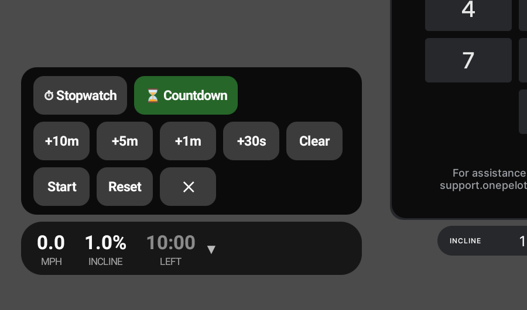

# Tread Overlay

A floating overlay for the Peloton Tread's built-in tablet showing live
**speed**, **incline**, and a **stopwatch / countdown timer** on top of any
app. Sideloaded with `adb`; no root, no changes to Peloton software.



## Features

- Compact pill, draggable anywhere on screen (position is remembered).
- Live MPH and incline, polled twice a second directly from the treadmill's
  hardware service. Works even while the console is locked.
- **Stopwatch mode:** tap the pill to start/pause, hold ~1 second to reset.
- **Countdown mode:** set a time with quick-add buttons (+10m / +5m / +1m /
  +30s), watch it count down with a draining progress bar (green → amber →
  red). At zero it beeps three times, flashes the pill red, then keeps
  counting up in red (`+MM:SS`, labeled OVER) so you know how far past your
  target you went. Reset restores the set time.
- Chevron (▲) on the pill's right end opens/closes the control panel
  (mode switch, time adjust, start/pause/reset).
- Mode and countdown setting survive restarts.
- Auto-starts after reboot/power loss (once the overlay permission has been
  granted and the app started once).

## Requirements

- JDK 17
- Android SDK command-line tools (or Android Studio) with platform 34 and
  build-tools; `sdkmanager "platforms;android-34" "build-tools;34.0.0" "platform-tools"`
- `adb` access to the tablet (Developer Options → USB debugging)

## Build

```bash
# point the build at your SDK (or set ANDROID_HOME)
echo "sdk.dir=$HOME/android-sdk" > local.properties

./gradlew :app:assembleDebug
# output: app/build/outputs/apk/debug/app-debug.apk
```

Note: the tablet is Android 10 (API 29). `targetSdk` is deliberately 29;
API 30+ tightens overlay and foreground-service rules that aren't needed
here.

## Deploy

```bash
adb install -r app/build/outputs/apk/debug/app-debug.apk

# grant the overlay permission without touching the tablet UI
adb shell appops set net.whyne.treadoverlay SYSTEM_ALERT_WINDOW allow

# start it
adb shell am start -n net.whyne.treadoverlay/.MainActivity
```

The launcher activity just checks the overlay permission, starts the
foreground service, and exits. If the permission is missing it opens the
system settings page for it instead.

The app registers a `BOOT_COMPLETED` receiver, so after the first manual
start it comes back on its own following any reboot or power loss (as long
as the overlay permission is granted).

If `adb install` fails with **"not enough space"**: the data partition is
probably nearly full (these tablets ship with only 4 GB). Reclaim app cache
safely with:

```bash
adb shell pm trim-caches 2G
```

## How it reads the treadmill

`AffernetClient.kt` binds the exported hardware-bridge service and polls two
synchronous, read-only getters via raw binder transactions:

- Intent action / interface token: `com.onepeloton.affernetservice.ITreadInterface`
- code 17 → current speed (int, tenths of mph)
- code 18 → current incline (int, tenths of a percent; sign ignored for display)

`MetricsClient.kt` is an alternative, callback-based client for the
workout-services metrics stream. It works but is unused: the stream is gated
by the console lock and the service's control actions have side effects on
the stock UI. It is kept for reference. `MetricsUpdateSource.kt` is a small
hand-written Parcelable stub matching the wire format of one of the vendor
types that appears in those callback bundles; it exists so the bundles can be
unparceled, and contains no vendor code.

## Uninstall

```bash
adb shell am force-stop net.whyne.treadoverlay
adb uninstall net.whyne.treadoverlay
```

## Disclaimer

Not affiliated with or endorsed by Peloton. Sideloading may void your
warranty. This app only reads sensor values; keep it that way.
